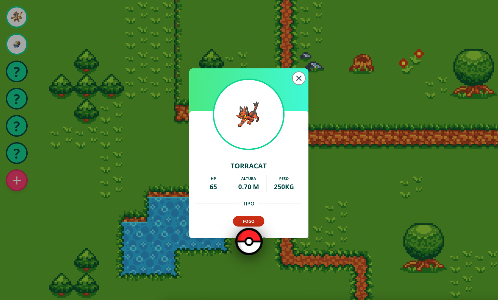

<h1 align="center">Bem vindo!👋</h1>
<p>
  
</p>

> Aplicação de Pokedex com React para a posição de Desenvolvedor Frontend na Corebiz!

## Funcionalidades:

- Gerar um pokemon randomico com suas respectivas imagens e info.
- Pode pegar o pokemon e adicionar a Pokedex 
- Pode remover o pokemon da Pokedex
- Pode ver as infos do Pokemon
- Pode adicionar no máximo 6 pokemons na Pokedex <br>
- Informações do tipo de pokemon traduzidas para português <br>
- Pode editar somente o nome de um Pokémon que foi capturado. <br>

## Algumas Bibliotecas utilizadas:

- Axios para chamadas API<br>
- React Hoook Form
- Yup para validações <br>
- Styled Components para estilização<br>
- React Router para rotas <br>
- Framer Motion para animações <br>
- React Hook Form para lidar com formulários <br>


## Faça o clone do Reposiório e depois instale as Dependências

```sh
yarn
```

## Para iniciar o projeto

```sh
yarn start
```

## Autor

👤 **Igor Ribeiro **

## Mostre o seu suporte!

Dê ⭐️ se você gostou deste projeto!

---

<a href="https://pokedex-2022.netlify.app/" alt="link podedex ftde">Link para página no ar</a> <br>


<p align="center">
Feito com ❤️
</p>
